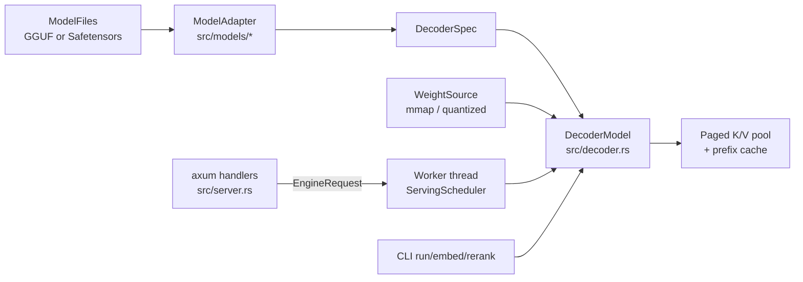

每个命令都经过 `LoadedRuntime::load`：打开文件，选择 adapter，从 `WeightSource` 构建共享 decoder，然后配置 paged K/V 池和 prefix cache。阻塞式命令直接调用模型。`serve` 在一个 worker 线程中构建同样的运行时，该线程在整个生命周期内独占模型。

```mermaid
flowchart LR
  F["ModelFiles<br/>GGUF or Safetensors"] --> A["ModelAdapter<br/>src/models/*"]
  A --> S["DecoderSpec"]
  S --> D["DecoderModel<br/>src/decoder.rs"]
  W["WeightSource<br/>mmap / quantized"] --> D
  D --> KV["Paged K/V pool<br/>+ prefix cache"]
  H["axum handlers<br/>src/server.rs"] -->|EngineRequest| E["Worker thread<br/>ServingScheduler"]
  E --> D
  C["CLI run/embed/rerank"] --> D
```
